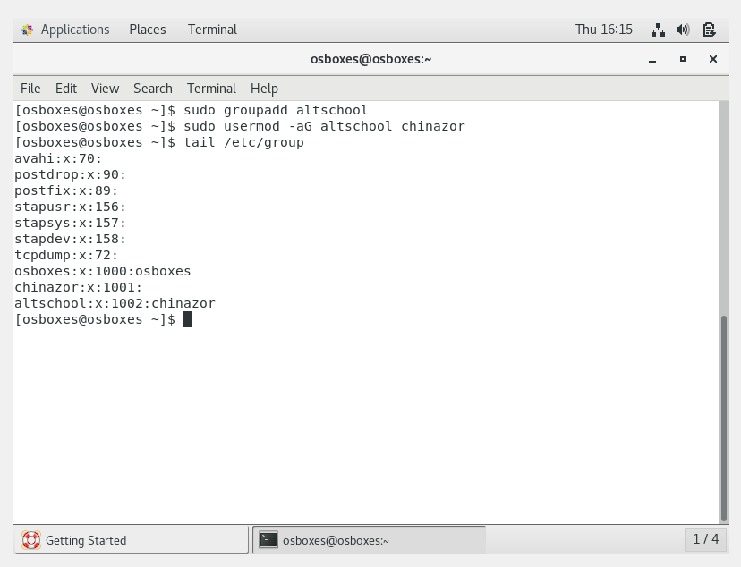

Create a User:
This was done by using sudo useradd username

Set an expiry date of 2 weeks for the user:
This was done by using sudo usermod -e YYYY-MM-DD

Prompt the user to change password on login:
This was done using sudo passwd -e username

User being asked to change password

Attach the user to a group called altschool:
First, i created altschool group using; 
sudo groupadd gropname.
Then i added the user to the group using;
sudo usermod -aG groupname username

Allow altschool grop to run only cat command:
This was done by editing the sudoers file.
1: sudo visudo.
2: %groupname All=(All) /bin/cat/etc

Create another user without home directory:
This was done using sudo useradd -M username

  